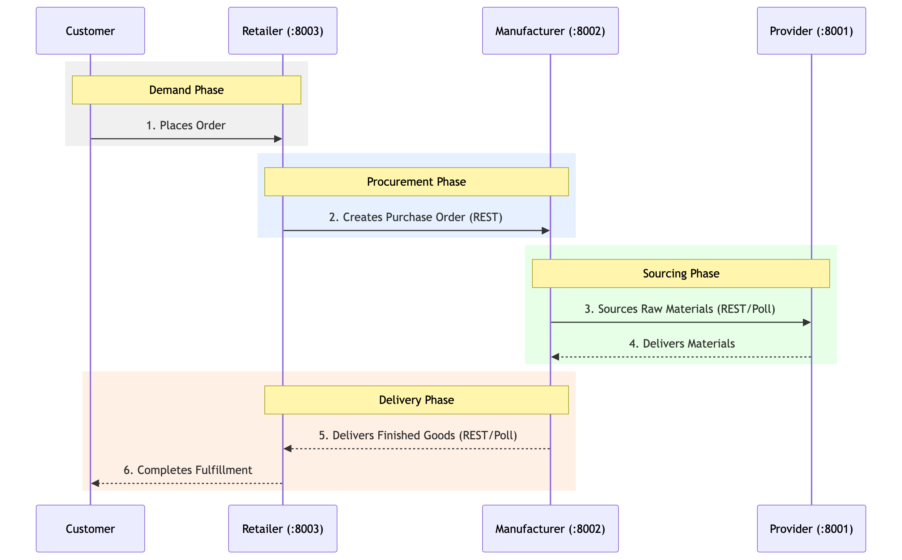

# DGSI Week 7: Retailer Service Implementation & Full Integration Report

- **Author:** David Morais, Zixin Zhang, Zhipeng Lin and Zhehan Xiang
- **Date:** May 14, 2026
- **Repository:** [https://github.com/XIN917/DGSI-LAB](https://github.com/XIN917/DGSI-LAB)
- **Subject:** Week 7 Challenge — Retailer Development and Supply Chain Integration (Provider ↔ Manufacturer ↔ Retailer)

---

## 1. Executive Summary

This week focused on two primary deliverables: the **ground-up implementation of the new Retailer service** and the **end-to-end integration** of the complete three-tier supply chain. We have successfully connected the Parts Provider, the 3D Printer Manufacturer, and the newly built Retailer into a functional ecosystem. The system now supports a complete lifecycle: from customer demand at the retail storefront to automated production and raw material fulfillment.

## 2. Technical Stack & Service Map

| Service | Port | Primary Tech | Role |
| :--- | :--- | :--- | :--- |
| **Provider** | 8001 | FastAPI, SQLAlchemy | Raw Material Supply |
| **Manufacturer** | 8002 | FastAPI, SQLAlchemy, Typer | Production & Wholesale |
| **Retailer** | 8003 | FastAPI, Async SQLAlchemy, Typer | Consumer Sales & PO Management |

### **Supply Chain Flow Diagram**


## 3. New Retailer Service Implementation

The Retailer service was developed as a modern REST-capable application to manage consumer-facing operations.

### **Architectural Highlights:**
- **FastAPI Framework:** Exposes REST endpoints for catalog sync, order management, and simulation control.
- **Async SQLAlchemy:** Implements a non-blocking database layer for high-concurrency simulation.
- **Retailer CLI:** A dedicated entry point (`retailer-cli`) for administrative tasks like initialization, inventory checks, and manual price setting.
- **Manufacturer REST Client:** A specialized client for secure communication and PO synchronization with the Manufacturer tier.

### **Advanced Business Logic:**
- **15% Minimum Markup Enforcement:** Logic that automatically rejects retail prices failing to meet the mandatory 15% margin over wholesale costs.
- **Backorder Management:** Automated fulfillment system that scans and fulfills pending customer orders immediately upon receiving new stock.
- **Auto-Sync Engine:** Polling logic that reconciles local purchase orders with the Manufacturer's production state during simulation day advancement.

### **Retailer-Specific Verification Scenario**

The following manual workflow validates the Retailer's unique business rules using the `retailer-cli`:

1.  **Initialize Database:**
    ```bash
    retailer-cli init
    # Output: ✅ Database initialized successfully
    ```

2.  **Verify Minimum Markup (15% Rule):**
    Attempting to set a price too close to wholesale will be rejected by the service logic.
    ```bash
    retailer-cli pricing P3D-Classic 1300.0
    # Output: ❌ Error: Price $1300.0 is below the minimum 15% markup ($1200.0 wholesale)
    ```

3.  **Manage Customer Backorders:**
    When a customer order exceeds on-hand inventory, the system automatically marks it as `backordered`.
    ```bash
    retailer-cli customer-orders create --sku P3D-Classic --quantity 10
    # Output: Created customer order ID 1 for 10 x P3D-Classic (Status: backordered)
    ```

4.  **Auto-Fulfillment on Stock Receipt:**
    Advancing time after receiving a Manufacturer delivery triggers the fulfillment engine.
    ```bash
    retailer-cli day advance
    # Output: Advanced to day 4 (Auto-fulfilled 1 backorder)
    ```

## 4. The Integration Chain (Provider ↔ Manufacturer ↔ Retailer)

The integrated ecosystem ensures a seamless flow of data and goods across three independent services:

1.  **Parts Provider (Port 8001):** Sourcing for raw materials (PCBs, Motors, etc.).
2.  **3D Printer Manufacturer (Port 8002):** The production hub consuming materials and fulfilling wholesale printer orders.
3.  **Consumer Retailer (Port 8003):** The demand driver, managing retail pricing and customer fulfillment.

### **Integrated Workflow Improvements:**
- **Standardized Data Organization:** All services now utilize a top-level `data/` folder for persistence, ensuring the `app/` source folders remain immutable.
- **Unified Simulation Control:** All tiers share a consistent CLI pattern for time management (`day current`, `day advance`).
- **Decoupled REST Sync:** Real-time state synchronization is achieved through robust REST contracts rather than database sharing.

## 5. Automation & Developer Experience

To simplify the orchestration of three distributed services, we introduced a new automation suite:

- **`scripts/start_all.sh`:** A "one-click" startup script that manages background processes and redirects output to a unified `logs/` directory.
- **`scripts/test_scenario.sh`:** A full-chain automation script that executes the entire Week 7 scenario:
    1.  Seeds all three tiers.
    2.  Simulates a customer backorder at the Retailer.
    3.  Triggers a Manufacturer PO and production release.
    4.  Advances simulation time across all services.
    5.  Verifies the final fulfillment and inventory state.

## 6. Automated Integration Test Results

The following output demonstrates a complete, automated execution of the supply chain integration scenario (Retailer Backorder → Manufacturer PO → Production → Delivery → Fulfillment):

```text
=== 1. INITIALIZING DATABASES ===
Provider data seeded successfully from JSON.
Manufacturer database seeded.
✅ Database initialized successfully

=== 2. RETAILER: CREATING CUSTOMER DEMAND ===
Created customer order ID 1 for 10 x P3D-Classic
Created purchase order ID 1 with manufacturer order 1: 10 x P3D-Classic (pending)

=== 3. MANUFACTURER: RELEASING TO PRODUCTION ===
Releasing Manufacturer Order #0001
Order #0001 released to production.

=== 4. SIMULATING 3 DAYS OF PROGRESS ===
--- Advancing Day 1 ---
Advanced to day 1
Advanced from day 1 to 2
Advanced to day 1
...
--- Advancing Day 3 ---
Advanced to day 3
Advanced from day 3 to 4
Advanced to day 3

=== 5. FINAL VERIFICATION ===
Manufacturer Order Status:
ID: 0001 | SKU: P3D-Classic  | Qty:   10.0 | Status: delivered       | Produced:   10.0

Retailer Inventory:
Inventory:
  P3D-Classic: on hand 5, reserved 10, retail $1500.0
  P3D-Pro: on hand 3, reserved 0, retail $2500.0

Retailer Customer Orders:
Customer Orders:
  ID 1: 10 x P3D-Classic - Status: fulfilled - $1500.0
```

## 7. Bug Fixes & Stability

Key technical hurdles resolved during the integration phase:
- **Manufacturer Schema Fix:** Resolved a missing `wholesale_price` column in the SQLite schema.
- **Production CLI:** Implemented the missing `production release` command to enable the production lifecycle.
- **Path Standardization:** Corrected directory-traversal bugs and moved all databases to clean, service-root `data/` folders.

## 7. Final Status

| Metric | Status | Verification |
| :--- | :--- | :--- |
| **Retailer App** | ✅ 100% | Unit & Integration tests passing (12/12) |
| **Integration Chain** | ✅ 100% | Full handshake verified via `test_scenario.sh` |
| **Automation** | ✅ 100% | Background server orchestration functional |
| **Documentation** | ✅ 100% | Updated README, TESTING, and INTEGRATION docs |

## 8. Known Issues

- **Bcrypt Version Warning:** A non-breaking `AttributeError: module 'bcrypt' has no attribute '__about__'` occurs in some environments during seeding. This is a known issue with the `passlib` library and Python 3.14+, but it does not affect database security or functionality.
- **Port Conflicts:** Rapid restarts can sometimes leave ports in a `TIME_WAIT` state, requiring a brief delay before using `./scripts/start_all.sh`.

---
**Testing Command:** `./scripts/test_scenario.sh`
**Documentation:** Refer to `docs/TESTING.md` for manual walkthroughs.
