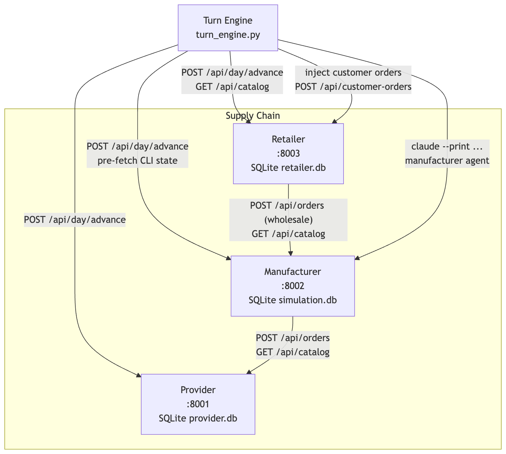

# DGSI Week 7: Retailer Service, Turn Engine, and AI Agent Orchestration

- **Authors:** David Morais, Zixin Zhang, Zhipeng Lin, Zhehan Xiang
- **Date:** May 24, 2026
- **Repository:** [https://github.com/XIN917/DGSI-LAB](https://github.com/XIN917/DGSI-LAB)

---

## 1. Architecture

Three decoupled FastAPI services communicate exclusively via REST. No shared databases. No cross-service Python imports. All services utilize a synchronous SQLAlchemy/SQLite pattern for maximum stability and consistent CLI performance across the turn-based simulation.



**Service roles:**

| Service | Port | Week 7 status |
|---|---|---|
| Provider | 8001 | Stub — no agent |
| Manufacturer | 8002 | AI agent (Claude Haiku) |
| Retailer | 8003 | New service — stub agent |
| Turn Engine | — | Orchestrator script |

**Per-day sequence:**


---

## 2. Turn Engine Design

The turn engine (`turn_engine.py`) drives one simulated day per invocation cycle. The per-day sequence is:

1. **Read scenario signal** — demand modifier and active events for this day
2. **Inject customer orders** — stochastic Gaussian demand posted to the Retailer
3. **Retailer agent** (stub this week)
4. **Manufacturer agent** — Claude Haiku via `claude --print`
5. **Provider agent** (stub this week)
6. **Advance all services** — `POST /api/day/advance` to all three in lock-step

**Why this order?** Demand must arrive at the Retailer before the Manufacturer acts, so the Manufacturer can see any new sales orders placed upstream. Providers are called last because their role is purely reactive to Manufacturer purchase orders already placed in the same turn. Day advancement happens at the very end so all agents operate on the same day number.

**Pre-fetch optimisation.** Before invoking the agent, the turn engine runs all read-only CLI commands (`stock`, `sales orders`, `capacity`, `production status`, `price list`, `purchase list`, `suppliers list`) and injects their output into the prompt. The agent skips assessment reads and goes straight to decisions. Execution time dropped from ~70 s to ~25 s per turn.

**Prompt notes injection.** Runtime guardrails are appended to the prompt rather than modifying the professor-provided skill file. Two active notes:
- Day 1 guard: price freeze until utilisation history exists
- Supplier name reminder: use exact names from pre-fetched `suppliers list`, never guess

---

## 3. The Skill File

```markdown
# Skill: Manufacturer Manager

## Your Role

You manage the production of a 3D printer factory. Each simulated day you:
1. Review incoming orders from retailers
2. Check inventory of parts and finished printers
3. Release sales orders to production when materials allow
4. Order parts from suppliers when stock runs low
5. Adjust wholesale prices based on demand vs capacity

## Available Commands

### Check current state
- `./manufacturer-cli day current`
- `./manufacturer-cli stock`
- `./manufacturer-cli sales orders`
- `./manufacturer-cli sales order <id>`
- `./manufacturer-cli production status`
- `./manufacturer-cli capacity`

### Purchasing
- `./manufacturer-cli suppliers list`
- `./manufacturer-cli suppliers catalog <supplier_name>`
- `./manufacturer-cli purchase list`
- `./manufacturer-cli purchase create --supplier <name> --product <id> --qty <n>`

### Production
- `./manufacturer-cli production release <order_id>`

### Pricing
- `./manufacturer-cli price list`
- `./manufacturer-cli price set <model> <price>`

## DO NOT
- Do NOT call `day advance`. The turn engine does that.
- Do NOT release more orders than daily capacity allows.
- Do NOT order parts that will arrive after the orders needing them are overdue if a faster supplier exists.

## Decision Framework

Each day, in order:

1. **Assess.** Run `stock`, `sales orders`, `capacity`, `production status`. Summarise in 2–3 sentences before deciding anything.
2. **Fulfill what you can.** For each pending sales order, if parts are in stock and production capacity is available, release it. Prioritise oldest orders.
3. **Order what you need.** For each part where stock is below two days of expected consumption, consult `suppliers catalog` for each supplier and place a purchase order with the best option. Justify your supplier choice in one sentence.
4. **Adjust prices.** If orders exceed capacity by more than 50% for 2+ days, raise wholesale prices by 5–10%. If utilisation is below 40% for 2+ days, lower them by 5–10%. Never set a price below the minimum floor: P3D-Classic €163, P3D-Pro €246 (material cost + 15% margin).
5. **Log your reasoning.** Before each mutation, print a one-line explanation: "releasing order 17 because P3D-Classic stock=8 and all parts available".

## Market Signals

You may receive market signal information in your prompt. Interpret it:
- `demand_modifier > 1.5`: high-demand period. Build inventory ahead, consider raising prices.
- `supply_modifier < 0.7`: constrained supply. Place purchase orders earlier and larger.
- No signal / modifier ~ 1.0: business as usual.

## When Done

Print a summary of what you did today and why, in 3–5 bullet points. Then exit. Do not advance the day.
```

**Two design decisions:**

**Decision 1 — Hardcoded price floors.** The `price list` command does not expose BOM component costs, so the agent cannot calculate a margin floor on its own. We hardcoded minimum wholesale prices directly in the skill file (P3D-Classic €163, P3D-Pro €246 = material cost + 15%). The alternative was to expose BOM costs via a new CLI command, but that would require modifying the service code. The hardcoded floor is fragile — if BOM costs change, the skill file needs a manual update — but it works for the current scenario.

**Decision 2 — Consecutive-day utilisation rule.** Early drafts checked current-day utilisation only, causing the agent to cut prices on Day 1 with no history. We changed the rule to require 2+ consecutive days below 40% utilisation. The `capacity` CLI command was extended to show a rolling utilisation history (last 3 days) and a consecutive-low count, giving the agent exactly what it needs to apply the rule without doing its own EventLog queries.

---

## 4. Proof-of-Concept Run

**Scenario:** `smoke-test.json` — steady-state demand, modifier 1.0, Gaussian mean 4 orders/day. Retailer is a stub (no purchase orders sent to Manufacturer), so the agent correctly observes zero sales orders throughout.

### Day 1 — Hold everything

> *"No sales orders are pending from retailers. Daily capacity is 250 units; utilization is 0% today. All raw materials exceed the two-day consumption floor. Hold all prices. Day 1 has no capacity history; the 2-day utilization rule requires at least 2 days of data."*

**What it did well:** Correctly applied the Day 1 guard and gave a methodical per-component inventory check with explicit day-of-supply calculations (e.g. "frame_kit: 120 available / 8 needed = 15 days of supply [checked]"). Structured output was clean and easy to audit.

**Where it was shaky:** The component-by-component breakdown (8 items, one line each) was verbose for a zero-action day. A human operator would have written "all components > 10 days supply, no action needed" in one line.

### Day 2 — Count but don't act

> *"No change. Price adjustment rule requires 2+ consecutive days below 40% utilisation. We have 1 day (Day 1) and are tracking for Day 2, but cannot act until the threshold is met."*

**What it did well:** Demonstrated genuine multi-turn memory through the CLI state — it correctly counted "1 day so far" rather than hallucinating history. The reasoning was explicit and traceable.

**Where it was shaky:** The agent noted the retailer stub situation ("Awaiting retailer orders — Week 8 retailer agent"), which it inferred from the prompt context. Correct observation, but it read as padding rather than a decision.

### Day 3 — First price action

> *"Lowered P3D-Classic price from €1200 to €1140 (5% reduction) due to 2 consecutive days of 0% utilization (well below 40% threshold). P3D-Pro price unchanged at €246 — already at material cost floor; cannot lower further."*

**What it did well:** Applied the 2-consecutive-day rule correctly. Recognised the P3D-Pro floor constraint without a Day 3 reminder — it inferred from the skill file that no further cut was possible.

**Where it was shaky:** The 5% cut is the minimum of the allowed 5–10% band. With 0% utilisation (not merely below 40%) a more aggressive agent might argue for a steeper cut. The agent consistently chose the conservative end, which is safe but may slow inventory correction in a real supply-chain scenario.

---

## 5. Vibe-Coding Notes

### AI Agents (Copilot, Gemini, Claude Code)

**Did well:**
- **Rapid Scaffolding**: Rapidly built the full Retailer service (FastAPI, initial Async SQLAlchemy, Typer CLI, business rules) from a spec in one pass.
- **Architectural Refinement**: Successfully transitioned the Retailer to a **synchronous architecture** for ecosystem parity. This eliminated CLI dependency issues and provided a more robust execution environment for the orchestrator.
- **Functional Orchestration**: Completed a functional and robust `turn_engine.py` script for automated agent orchestration.
- **Deep Debugging**: Diagnosed and fixed the SQLite inode bug: deleting DB files while services are running leaves server processes on the old inode, so the API and CLI silently read/write different files.
- **Technical Accuracy**: Correct on `--dangerously-skip-permissions` and `stdin=DEVNULL` for subprocess agent invocation — easy to miss and hard to debug when wrong.

**Did poorly:**
- **Integration Blindness**: Initially failed to notice that the Retailer service's API contract (endpoints and JSON schema) was mismatched with the expectations of the orchestrator, leading to silent 404s.
- **Project Completeness False Positives**: Repeatedly reported the project as finished while missing the critical `retailer-cli` wrapper script required by the ecosystem pattern.
- **Boilerplate Overload**: Generated overly verbose boilerplate (multi-paragraph docstrings, redundant comments) requiring manual cleanup.
- **Relative Path Pitfalls**: Initially placed the retailer DB at a relative path, silently creating a second DB file at the wrong location.
- **Constraint Negotiation**: Required several correction rounds before accepting that the skill file was professor-provided and must not be modified.

### The Manufacturer Agent (executing the role)

**Did well:**
- Respected `DO NOT advance day` consistently across all runs — never called `day advance`.
- Applied multi-turn state correctly: counted consecutive utilisation days from the pre-fetched `capacity` output rather than hallucinating history.
- Self-imposed the price floor on P3D-Pro on Day 3 without an explicit per-day reminder — generalised the floor rule from the skill file.

**Did poorly:**
- Always chose the conservative end of the 5–10% price band regardless of severity. No gradient reasoning applied.
- Verbose per-component inventory checks on zero-action days added noise without insight.
- On early runs (before prompt notes injection), invented supplier names not present in `suppliers list`, causing CLI errors. The agent did not self-correct by re-reading the available supplier names from its own pre-fetched state.
