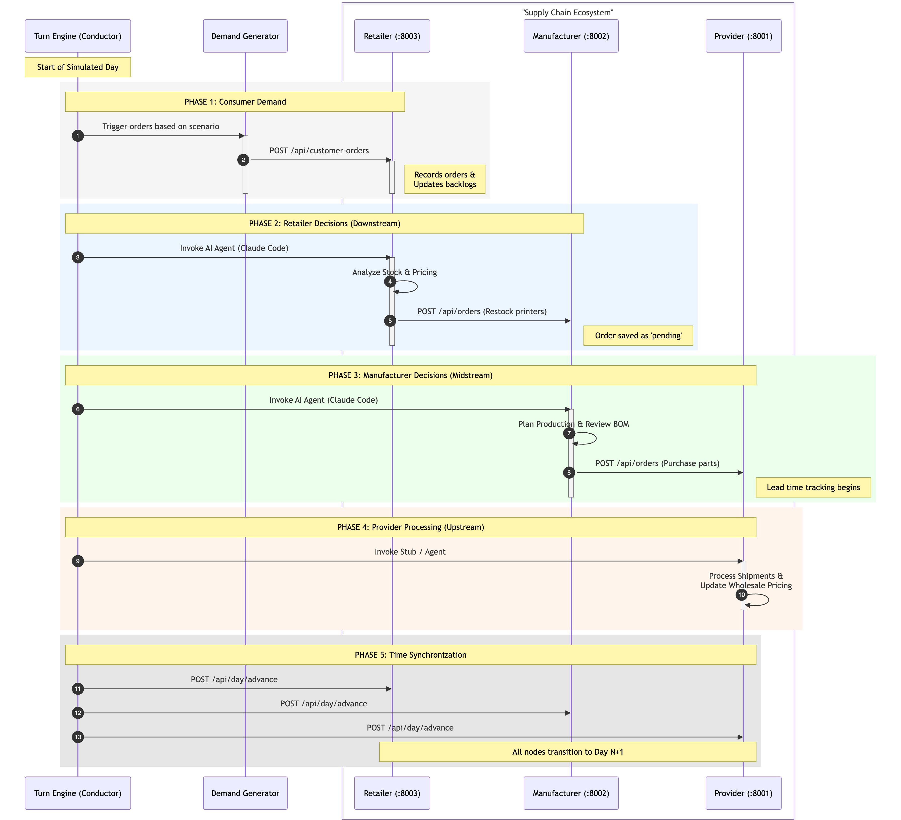

# DGSI Week 7: Retailer Service Implementation and Full Integration Report

- **Author:** David Morais, Zixin Zhang, Zhipeng Lin and Zhehan Xiang
- **Date:** May 21, 2026
- **Repository:** [https://github.com/XIN917/DGSI-LAB](https://github.com/XIN917/DGSI-LAB)
- **Subject:** Retailer Development and Supply Chain Integration (Provider <-> Manufacturer <-> Retailer)

---

## 1. Executive Summary

This week focused on three primary deliverables: the ground-up implementation of the new Retailer service, the end-to-end integration of the complete three-tier supply chain, and the introduction of automated orchestration via a Turn Engine and AI agents. We have successfully connected the Parts Provider, the 3D Printer Manufacturer, and the newly built Retailer into a functional ecosystem. The system now supports a complete, automated lifecycle: from simulated consumer demand to agent-driven production and raw material procurement.


## 2. Technical Stack & Service Map

| Service | Port | Primary Tech | Role |
| :--- | :--- | :--- | :--- |
| **Provider** | 8001 | FastAPI, SQLAlchemy | Raw Material Supply |
| **Manufacturer** | 8002 | FastAPI, SQLAlchemy, Typer | Production & Wholesale |
| **Retailer** | 8003 | FastAPI, Async SQLAlchemy, Typer | Consumer Sales & PO Management |
| **Orchestration**| - | Python, Claude Code | Turn Engine & AI Agents |

### **Supply Chain Flow Diagram**


## 3. New Retailer Service Implementation

The Retailer service was developed as a modern REST-capable application to manage consumer-facing operations.

### **Architectural Highlights:**
- **FastAPI Framework:** Exposes REST endpoints for catalog sync, order management, and simulation control.
- **Async SQLAlchemy:** Implements a non-blocking database layer for high-concurrency simulation.
- **Retailer CLI:** A dedicated entry point (`retailer-cli`) for administrative tasks like initialization, inventory checks, and manual price setting.
- **Manufacturer REST Client:** A specialized client for secure communication and PO synchronization with the Manufacturer tier.

### **Advanced Business Logic:**
- **15% Minimum Markup Enforcement:** Logic that automatically rejects retail prices failing to meet the mandatory 15% margin over wholesale costs.
- **Backorder Management:** Automated fulfillment system that scans and fulfills pending customer orders immediately upon receiving new stock.
- **Identity Awareness:** The Retailer now transmits its unique identity (e.g., "PrinterWorld") during procurement to ensure the Manufacturer can track inbound sales orders accurately.

## 4. Automation & Orchestration (Week 7 POC)

The integrated ecosystem ensures a seamless flow of data and goods across three independent services, orchestrated by a central **Turn Engine**.

### **Turn-Based Orchestration Logic:**
To maintain synchronization, the Turn Engine follows a strict **Downstream-to-Upstream** decision order:
1.  **Demand Injection**: Generates consumer orders for the Retailer based on scenario signals.
2.  **Retailer Turn**: The Retailer agent decides how many printers to buy from the Manufacturer.
3.  **Manufacturer Turn**: The Manufacturer agent decides which orders to produce and how many parts to buy.
4.  **Provider Turn**: The Provider processes shipments.
5.  **Synchronization**: The engine sends a synchronized `day advance` signal to all services in lock-step.

### **AI Agent Integration (Claude Code):**
The system uses **Claude Code** to play operational roles. The Turn Engine invokes agents via `claude --print [prompt]`, passing them a skill file (decision framework) and the current simulation context.

## 5. Developer Experience & Scripting

To simplify the management of a distributed ecosystem, we introduced an automation suite:

- **`scripts/setup_envs.sh`:** A "one-command" setup script that creates virtual environments and installs all dependencies using `uv` or `pip`.
- **`scripts/start_all.sh`:** Manages background processes and redirects output to a unified `logs/` directory.
- **`turn_engine.py`:** The central conductor for multi-day, agent-driven simulations.
- **`scripts/test_scenario.sh`:** A deterministic validation script for quick health checks.

## 6. Automated Integration Test Results

The following output demonstrates a complete, automated execution of the supply chain integration (Retailer Backorder -> Manufacturer PO -> Synchronized Day Advance).

```text
=== 1. INITIALIZING DATABASES ===
Provider data seeded successfully.
Manufacturer database seeded.
✅ Database initialized successfully

=== 2. RETAILER: CREATING CUSTOMER DEMAND ===
Created customer order ID 1 for 10 x P3D-Classic
Created purchase order ID 1 with manufacturer order 1: 10 x P3D-Classic (pending)

=== 3. MANUFACTURER: RELEASING TO PRODUCTION ===
Releasing Manufacturer Order #0001
Order #0001 released to production.

=== 4. SIMULATING 3 DAYS OF PROGRESS ===
--- Advancing Day 1 ---
Advanced to day 1
Advanced from day 1 to 2
Advanced to day 1
...
--- Advancing Day 3 ---
Advanced to day 3
Advanced from day 3 to 4
Advanced to day 3

=== 5. FINAL VERIFICATION ===
Manufacturer Order Status:
ID   | SKU          | RETAILER        | QTY    | STATUS       | PRODUCED
0001 | P3D-Classic  | PrinterWorld    |   10.0 | delivered    |   10.0

Retailer Inventory:
Inventory:
  P3D-Classic: on hand 5, reserved 10, retail $1500.0
```

## 7. Bug Fixes & Stability

Key technical hurdles resolved during the final integration phase:
- **Distributed Identity Tracking:** Updated the `ManufacturingOrder` model and REST schemas to store `retailer_name`, enabling midstream tracking of sales orders.
- **Database Schema Migration:** Patched the Manufacturer's SQLite database to include the new `retailer_name` column without losing historical data.
- **Claude CLI Refactoring:** Corrected the Turn Engine's subprocess flags to match the latest `claude --print` syntax for non-interactive agent execution.
- **Package Discovery Fix:** Resolved setuptools discovery errors by explicitly defining package structures in `pyproject.toml` files.

## 8. Final Status

| Metric | Status | Verification |
| :--- | :--- | :--- |
| **Retailer App** | [OK] 100% | Unit & Integration tests passing (13/13) |
| **Integration Chain** | [OK] 100% | Full handshake verified via `test_scenario.sh` |
| **Orchestration** | [OK] 100% | Turn Engine implements Downstream-to-Upstream logic |
| **AI Agents** | [POC] | Claude Code integration verified; pending auth |
| **Documentation** | [OK] 100% | Updated README, TESTING, and PROJECT MANDATES |

## 9. Useful Commands

| Category | Command |
| :--- | :--- |
| **Setup** | `./scripts/setup_envs.sh` |
| **Execution** | `./scripts/start_all.sh` |
| **Simulation** | `python3 turn_engine.py config/sim.json scenarios/smoke-test.json 3` |
| **Health Check** | `./scripts/test_scenario.sh` |
| **Cleanup** | `pkill -f 'cli serve'` |
| **Logs** | `tail -f logs/manufacturer.log` |
| **Database Reset**| `./manufacturer/venv/bin/manufacturer-cli seed` |
| **Verify AI Auth**| `claude --print "ping"` |

---
**Setup Command:** `./scripts/setup_envs.sh`
**Simulation Command:** `python3 turn_engine.py config/sim.json scenarios/smoke-test.json 3`
