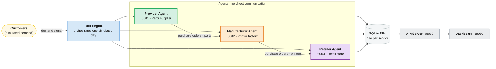
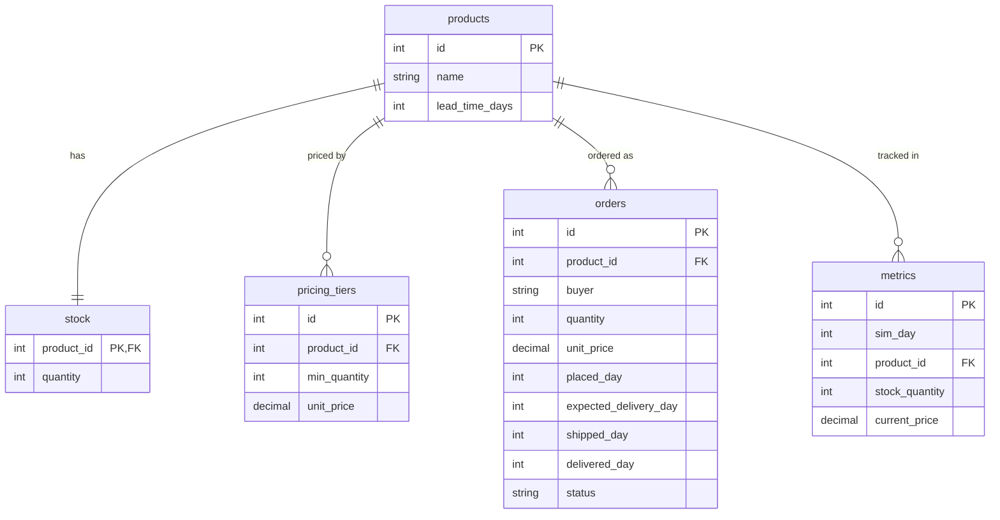
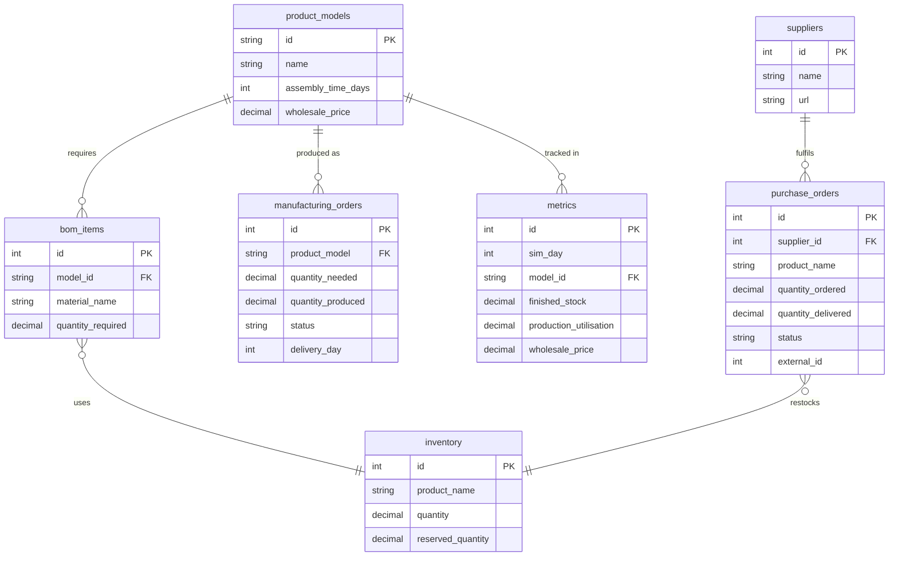
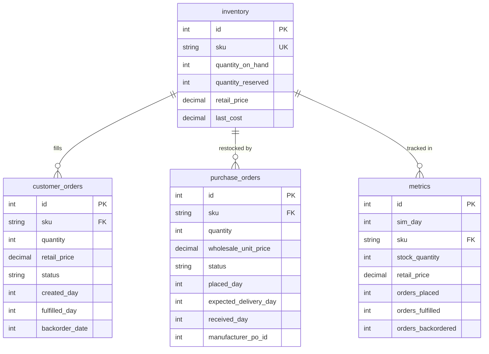

# Diagram Source (Mermaid)

## Architecture

```mermaid
flowchart LR
    CU(["`**Customers**
(simulated demand)`"])
    TE["`**Turn Engine**
orchestrates one simulated day`"]

    subgraph agents["Agents  ·  no direct communication"]
        PA["`**Provider Agent**
:8001 · Parts supplier`"]
        MA["`**Manufacturer Agent**
:8002 · Printer factory`"]
        RA["`**Retailer Agent**
:8003 · Retail store`"]
    end

    CU -. "demand signal" .-> TE
    TE --> PA & MA & RA

    PA -- "purchase orders · parts" --> MA
    MA -- "purchase orders · printers" --> RA

    PA & MA & RA --> DBS[("SQLite DBs\none per service")]
    DBS --> API["`**API Server** · :8000`"]
    API --> DASH["`**Dashboard** · :8080`"]

    style TE  fill:#D6E8F7,color:#1a1a1a,stroke:#4A90D9,stroke-width:2px
    style PA  fill:#D5F0E2,color:#1a1a1a,stroke:#27AE60,stroke-width:2px
    style MA  fill:#FDEBD0,color:#1a1a1a,stroke:#E67E22,stroke-width:2px
    style RA  fill:#EAD9F7,color:#1a1a1a,stroke:#8E44AD,stroke-width:2px
    style CU  fill:#FEF9E7,color:#1a1a1a,stroke:#F1C40F,stroke-width:1px
    style DBS fill:#F4F6F7,color:#1a1a1a,stroke:#95A5A6,stroke-width:1px
    style API fill:#EAECEE,color:#1a1a1a,stroke:#5D6D7E,stroke-width:1px
    style DASH fill:#EAECEE,color:#1a1a1a,stroke:#5D6D7E,stroke-width:1px
```

## Provider ER Diagram

```mermaid
erDiagram
    products {
        int id PK
        string name
        int lead_time_days
    }
    stock {
        int product_id PK,FK
        int quantity
    }
    pricing_tiers {
        int id PK
        int product_id FK
        int min_quantity
        decimal unit_price
    }
    orders {
        int id PK
        int product_id FK
        string buyer
        int quantity
        decimal unit_price
        int placed_day
        int expected_delivery_day
        int shipped_day
        int delivered_day
        string status
    }
    metrics {
        int id PK
        int sim_day
        int product_id FK
        int stock_quantity
        decimal current_price
    }
    products ||--|| stock : "has"
    products ||--o{ pricing_tiers : "priced by"
    products ||--o{ orders : "ordered as"
    products ||--o{ metrics : "tracked in"
```

## Manufacturer ER Diagram

```mermaid
erDiagram
    product_models {
        string id PK
        string name
        int assembly_time_days
        decimal wholesale_price
    }
    bom_items {
        int id PK
        string model_id FK
        string material_name
        decimal quantity_required
    }
    inventory {
        int id PK
        string product_name
        decimal quantity
        decimal reserved_quantity
    }
    manufacturing_orders {
        int id PK
        string product_model FK
        decimal quantity_needed
        decimal quantity_produced
        string status
        int delivery_day
    }
    suppliers {
        int id PK
        string name
        string url
    }
    purchase_orders {
        int id PK
        int supplier_id FK
        string product_name
        decimal quantity_ordered
        decimal quantity_delivered
        string status
        int external_id
    }
    metrics {
        int id PK
        int sim_day
        string model_id FK
        decimal finished_stock
        decimal production_utilisation
        decimal wholesale_price
    }
    product_models ||--o{ bom_items : "requires"
    product_models ||--o{ manufacturing_orders : "produced as"
    product_models ||--o{ metrics : "tracked in"
    suppliers ||--o{ purchase_orders : "fulfils"
    bom_items }o--|| inventory : "uses"
    purchase_orders }o--|| inventory : "restocks"
```

## Retailer ER Diagram

```mermaid
erDiagram
    inventory {
        int id PK
        string sku UK
        int quantity_on_hand
        int quantity_reserved
        decimal retail_price
        decimal last_cost
    }
    customer_orders {
        int id PK
        string sku FK
        int quantity
        decimal retail_price
        string status
        int created_day
        int fulfilled_day
        int backorder_date
    }
    purchase_orders {
        int id PK
        string sku FK
        int quantity
        decimal wholesale_unit_price
        string status
        int placed_day
        int expected_delivery_day
        int received_day
        int manufacturer_po_id
    }
    metrics {
        int id PK
        int sim_day
        string sku FK
        int stock_quantity
        decimal retail_price
        int orders_placed
        int orders_fulfilled
        int orders_backordered
    }
    inventory ||--o{ customer_orders : "fills"
    inventory ||--o{ purchase_orders : "restocked by"
    inventory ||--o{ metrics : "tracked in"
```
