# Final Report — DGSI Weeks 6–8: Supply Chain Simulation

**Course:** DGSI — Disseny i Gestió de Sistemes d'Informació  
**Team:** David Morais, Zixin Zhang, Zhehan Xiang & Zhipeng Lin  
**Repository:** https://github.com/XIN917/DGSI-LAB  
**Demo video:** https://drive.google.com/file/d/1CWARsnGUgXUnfCsaF9AQz922A5aBERTx/view?usp=sharing

---

## Contents

1. [Architecture](#architecture)
2. [Agent Design](#agent-design)
3. [Results](#results)
   - [3.1 Calm Market](#calm-market)
   - [3.2 Holiday Rush](#holiday-rush)
   - [3.3 Specific Analysis Questions](#analysis-questions)
   - [3.4 Scenario Comparison](#scenario-comparison)
4. [Vibe-Coding Reflection](#vibe-coding)
5. [Annex A — Simulation Charts](#annex-a)
6. [Annex B — Dashboard](#annex-b)

---

## 1. Architecture {#architecture}

The system is an autonomous multi-agent supply chain simulation for 3D printers. Three independent microservices — Provider, Manufacturer, Retailer — each driven by an LLM agent playing a business role. A turn engine orchestrates them through simulated days. Scenarios inject market pressure via demand, supply, and lead-time multipliers. Agents never communicate directly — the only shared state is what each service exposes through its HTTP API.

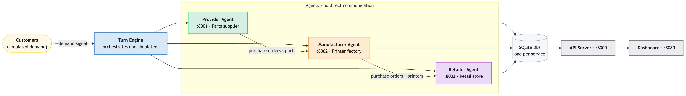

Each service is a FastAPI application with its own SQLite database and CLI. The turn engine prefetches state for all three agents in parallel, runs them concurrently, then advances all services via `POST /api/day/advance`. A separate API server (`api_server.py`, :8000) wraps the turn engine for frontend integration, exposing 15 endpoints including SSE streaming for live output. A browser dashboard (`dashboard/`, :8080) shows real-time inventory, prices, fulfillment, and service health, and allows starting simulations and switching between live data and archived scenario runs. See **Annex B** for dashboard screenshots.

### Provider (:8001)

Parts supplier. Holds raw component stock across 11 parts (frame kits, extruder kits, hotends, PCB boards, etc.), fulfills purchase orders from the manufacturer, and adjusts tier-1 prices based on stock depletion pressure. Built in week 6.

### Manufacturer (:8002)

3D printer factory. Buys parts from the provider, runs production orders, sells finished printers (P3D-Classic and P3D-Pro) to the retailer. Price floors: €163 (Classic), €246 (Pro). In week 8 the service was significantly refactored: direct database calls were replaced with a proper service layer, authentication was removed (it blocked agent access), and the HTTP day-advance path was updated to poll external suppliers before advancing — a delivery-sync invariant required for the simulation to work correctly. Built in week 5, refactored in week 8.

### Retailer (:8003)

Retail store. Manages customer orders, fulfills or backlogs them against stock, places purchase orders with the manufacturer, and sets retail prices. The retailer is the downstream end of the supply chain — all customer demand enters here, and signals propagate upstream through purchase orders. Built in week 7.

### Turn Engine

Orchestrates all three agents each simulated day: generates customer demand modulated by the scenario, prefetches state for all agents in parallel, runs all three agents concurrently, advances services via HTTP, saves logs, and appends KPI data to `logs/{scenario}/run.csv`. At the end of each run, databases are snapshotted and charts are generated automatically. Built in week 7, extended in week 8 with parallelization, model flexibility (Gemini/Gemma/Claude), compact prompts, and auto chart generation.

### How Market Signals Flow

Each scenario event carries four fields: `demand_modifier`, `supply_modifier`, `lead_time_modifier`, and `price_sensitivity`. At the start of each day the turn engine reads the active events, multiplies their modifiers (overlapping events compound — not last-wins), and embeds the resulting signal in each agent's prompt as a structured block. The retailer sees `demand_modifier` and `price_sensitivity` directly and uses them to decide reorder quantities and pricing aggressiveness. The manufacturer sees the same signal and uses `supply_modifier` as a production-risk hint. The provider sees `supply_modifier` and `lead_time_modifier`, which inform how conservatively it prices and ships. No agent receives another agent's internal state — the signal is the only shared forward-looking information, and even that is advisory: agents may ignore it.

### Data Models

Each service maintains its own SQLite database. Key tables per service:

**Provider**

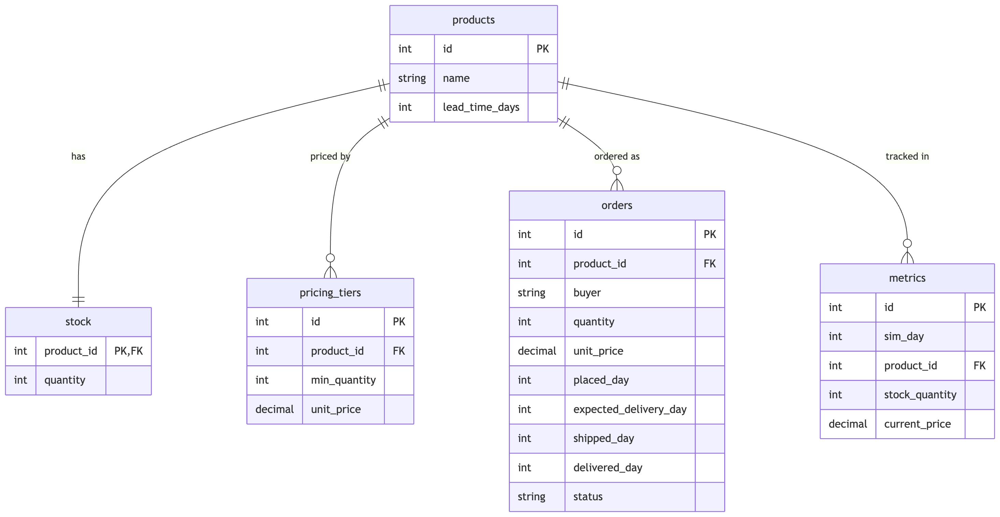

**Manufacturer**

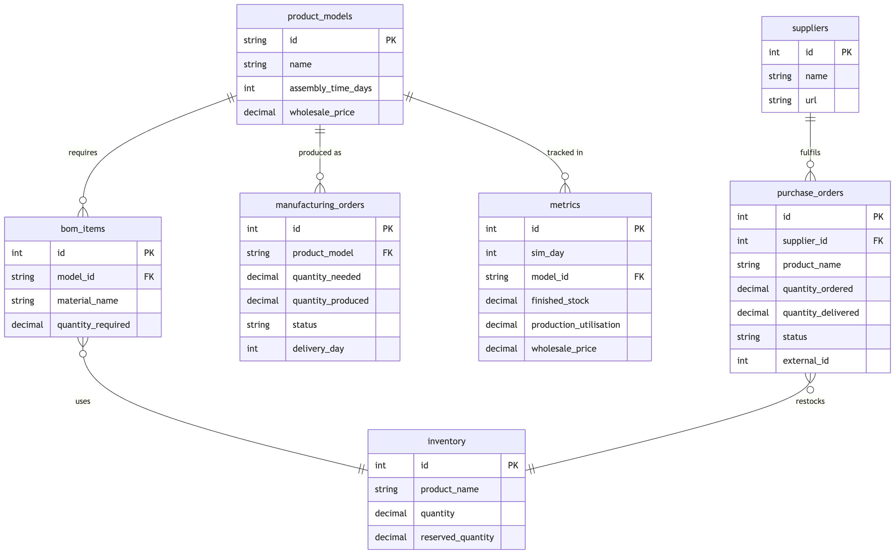

**Retailer**

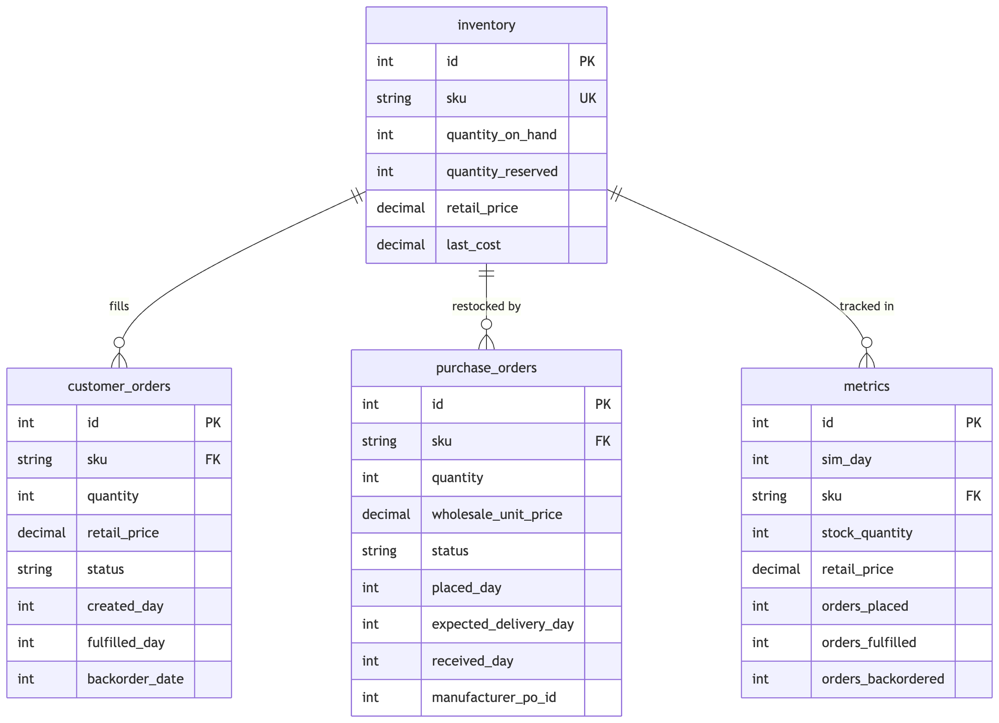

The `metrics` table in each service is a per-day snapshot written on `POST /api/day/advance`. It is the source of truth for all charts and dashboard KPIs. The three databases are never joined across services — inter-service communication happens exclusively via HTTP.

---

## 2. Agent Design {#agent-design}

Each agent is driven by a markdown skill file (`skills/`) that defines its role, available CLI commands, decision rules, and constraints. The skill files are the authoritative spec — CLIs were aligned to match them, not the reverse.

### Provider Manager

Each day: ships pending orders, checks stock levels, restocks depleted parts, raises tier-1 prices when stock falls below a threshold. The skill instructs the agent never to lower prices — but in the holiday-rush run the provider cut `stepper_motor` from €15 to €11 on day 18, deviating from the rule when faced with excess stock and no incoming demand.

### Manufacturer Manager

Each day: processes incoming retailer purchase orders, checks parts availability, starts or releases production runs, places restock orders with the provider when parts are low, adjusts wholesale prices. A 1-day lag between retailer orders and manufacturer fulfillment is intentional and realistic.

### Retail Manager

Each day: fulfills or backlogs customer orders, checks inventory, places purchase orders with the manufacturer when stock is low, adjusts retail prices based on demand pressure. No hard price floor — the retailer applies percentage increments freely in response to stock signals.

### Skill Authoring — Decisions and Rewrites

The first versions of all three skill files were written before any simulation had run, which meant they were full of untested assumptions.

**Provider:** The initial skill had no price cap — the agent raised prices freely every day, which compounded into absurd figures (€500+ for a €32 part) over 15 days. A `DO NOT change a tier's price more than 15% in one day` constraint was added after observing this in the first calm-market run. The restock trigger was also originally based on absolute stock levels; it was rewritten to use percentage-of-starting-level so behaviour scaled correctly with the product catalog.

**Manufacturer:** The original skill asked the agent to "check parts availability and start production." In early runs the agent interpreted this as checking each BOM item individually (8 CLI calls) before making a single production decision, frequently hitting turn budget limits before any orders were released. The skill was rewritten to instruct the agent to use prefetched state as its assessment step and batch all production decisions into as few Bash turns as practical. A separate bug — authentication middleware blocking all agent CLI calls — was fixed in the service layer itself.

**Retailer:** The first retailer skill had no explicit rule about backorders. Early runs left customer orders in `pending` state indefinitely because the agent fulfilled what it could and moved on. The constraint `DO NOT leave customer orders in pending — every one becomes fulfilled or backordered by end of turn` was added after day-3 logs showed 11 orders accumulating in pending. The reorder threshold (below 3 days of recent average demand) was also calibrated empirically — the original "below 10 units" flat threshold caused over-ordering in calm conditions and under-ordering during Black Friday.

### Strengths and Weaknesses

| Agent | Good at | Bad at |
|---|---|---|
| Provider | Consistent restocking; price signals scale with stock pressure | Never lowers prices; cannot distinguish transient from structural demand |
| Manufacturer | Proactive stock builds ahead of visible demand signals; BOM-aware ordering | Cannot signal upstream constraints to the retailer; halts production conservatively under shortage even when partial production would help |
| Retailer | Rapid fulfillment decisions; price increments as rationing signal | No lookahead; treats each day's stock reading independently, producing monotonic price escalation with no ceiling |

### Prompt Engineering
Full skill files are used only for debugging. Normal runs send compact per-role contracts to reduce token usage. Each agent is instructed to use prefetched state as its assessment step, batch mutations, and keep summaries under 120 words. Turn budgets: retailer 6, manufacturer 8, provider 8 — set high enough to avoid truncation on complex day-10+ decisions in 25-day runs.

---

## 3. Results {#results}

### 3.1 Calm Market (15 days) — 84.4% fill rate {#calm-market}

| Metric | Value |
|---|---|
| Model | gemini-3.1-flash-lite |
| Total orders | 45 |
| Fulfilled | 38 |
| Backordered | 7 |
| Fill rate | 84.4% |
| Duration | 9m 31s |

**Inventory:** Manufacturer Classic stock drops to near-zero in the first few days as initial retailer orders drain it, then a production batch restores it around day 8. Pro stock spikes mid-run and is drawn down steadily. The retailer accumulates a large buffer by day 13, after which the manufacturer holds minimal finished stock because the retailer is adequately covered.

**Prices:** Manufacturer wholesale prices drop to floor from day 2 onward. Retail prices climb steadily with the retailer applying routine increments every few days as a demand-management lever. Provider part prices remain entirely flat — no stockout pressure in calm conditions.

**Interpretation:** In the absence of shocks, agents converge to a stable equilibrium within 6–8 days. The backordered orders occurred in days 1–6 as initial stock ran low before the first manufacturer delivery arrived — a pure logistics lag, not a decision error. See **Annex A.1** for charts.

---

### 3.2 Holiday Rush (25 days) — 91.2% fill rate {#holiday-rush}

| Metric | Value |
|---|---|
| Model | gemini-3.1-flash-lite |
| Total orders | 114 |
| Fulfilled | 104 |
| Backordered | 10 |
| Fill rate | 91.2% |
| Duration | 16m 59s |

**Events:** Black Friday days 11–13 (demand ×3.0), Chip Shortage days 14–20 (supply ×0.4, lead time ×2.0), Christmas days 18–25 (demand ×2.5). Days 18–20 overlap: effective demand ×3.75.

**Black Friday response:** In the days before day 11 the manufacturer released large production batches ahead of the shock, building a substantial retailer buffer. Fill rate was 100% on days 11–13 — the pre-build strategy worked.

**Chip shortage:** Two provider price changes occurred: `dual_extruder_kit` rose on day 14 (consistent with the skill rule), while `stepper_motor` fell on day 18 — an agent deviation from the rule of never lowering prices, likely triggered by excess stock with no incoming orders. Pro stock had already been drawn down before the shortage began; during it, Pro production was simply not replenished. Retail prices escalated sharply by day 25 as the retailer used pricing as a demand-rationing mechanism.

**Fulfillment:** Backorders fell into two clusters — a few early ones before stock builds, and a few at days 24–25 as the Christmas-tail buffer ran dry. Zero lost orders. See **Annex A.2** for charts.

---

### 3.3 Specific Analysis Questions {#analysis-questions}

**Did the manufacturer build stock ahead of Black Friday?**
Yes — and it worked. The pre-build was not triggered by the scenario signal directly but by the retailer placing larger purchase orders as early as day 5. The manufacturer responded to downstream pull, not the demand modifier it was shown. That distinction matters: the agent behaved correctly for the wrong reason — it reacted to an order signal it could observe rather than anticipating a shock it was told about.

**When stockouts happened, whose decision was the proximate cause?**
In both clusters (days 1–5 and days 24–25) the proximate cause was the manufacturer's production stance, not the retailer's ordering behaviour. The retailer ordered on time; the manufacturer either had not yet produced (days 1–5 lag) or had halted production conservatively during the shortage (days 24–25). The retailer had no visibility into which of those was happening — it could only see its own stock falling.

**Did prices stabilise or oscillate?**
Neither: they ratcheted. The retailer has no price ceiling and no memory of prior days' adjustments, so each increment compounds. In calm-market this produces a gentle climb; in holiday-rush the same mechanic produces a several-fold price increase by day 25. The interesting case is the provider's `stepper_motor` cut — the only downward price move in either run — which the skill file explicitly prohibits. It suggests the agent de-prioritised the constraint when faced with unsellable stock, treating the rule as advisory under extreme conditions.

**Can you identify a bullwhip moment?**
Days 18–21. Retail demand was at 3.75×, but the retailer placed zero new purchase orders with the manufacturer because its existing buffer was large. The manufacturer saw silence and halted production. The provider saw no new orders and stopped restocking. The actual demand signal (3.75×) was completely invisible upstream. This is a demand absorption effect — the mirror image of the classic bullwhip: instead of a small signal amplifying into large upstream orders, a large signal was absorbed entirely by downstream buffers, leaving upstream tiers idle during peak downstream stress. Both patterns arise from the same root cause: agents optimising locally without visibility into the rest of the chain.

---

### 3.4 Scenario Comparison {#scenario-comparison}

The calm-market and holiday-rush runs use identical agents and skill files — the only difference is the scenario JSON. In calm-market, agents converge to a stable equilibrium within 6–8 days: the manufacturer produces in moderate batches, the retailer holds a moderate buffer, and prices climb gently. In holiday-rush, the same agents handle the first shock (Black Friday) correctly — proactive stock building and a 100% fill rate on days 11–13. Counterintuitively, the holiday-rush run achieves a higher overall fill rate (91.2%) than calm-market (84.4%): the aggressive pre-build strategy more than compensated for the late-run shortfall, and the 7 early backorders in calm-market (day 1–6 lag before first delivery) pulled its fill rate down more than the 10 backorders spread across 25 days in holiday-rush. However, the chip shortage exposes the core weakness: the retailer does not know the manufacturer cannot restock; the manufacturer does not know the provider's parts are constrained. Each agent applies its local rule optimally, but the combined effect is a supply chain freeze — manufacturer halts production, retailer raises prices until demand disappears, provider sits on stock it cannot sell. The calm-market run shows the skill files work under stable conditions; the holiday-rush run shows they work locally but lack a coordination protocol for cascading shocks.

---

## 4. Vibe-Coding Reflection {#vibe-coding}

This project was built using LLM coding assistants throughout — architecture, service implementation, CLI design, the turn engine, the dashboard, tests, and this report. The methodology is "vibe-coding": describing intent conversationally, reviewing what was generated, and iterating. The tooling journey itself turned out to mirror the supply chain problem: coordination without shared memory is hard.

The project moved through tools sequentially: Gemini for weeks 5 and 6, then GitHub Copilot, then Codex until the usage limit was hit, then back to Gemini (free tier) which struggled to complete tasks reliably, and finally Claude Code (paid) which carried week 8 to completion. Each switch was a cold start — a new agent arriving with no memory of prior decisions. Without knowing each tool's naming convention for its context file, the instinct was to put context in `docs/` — `PRD.md`, `PLAN.md`, `TESTING.md`. Agents could read these for project context, but there was no document guiding *how* the agent should behave: what to prioritise, what constraints to respect, what not to touch. That gap showed. It was during the Gemini phase that the pattern became clear: `GEMINI.md` was created, and every session started with *"Read GEMINI.md and the codebase, then tell me…"* When switching to Claude Code, `GEMINI.md` became `CLAUDE.md` — and because the context was already written down, that transition was not a cold start. The tool-specific context file, kept updated through every session, turned out to be load-bearing infrastructure, not just documentation.

**What worked well:**
- LLM assistance is fast at boilerplate — FastAPI endpoints, SQLite queries, Playwright tests, and chart generation code were produced in minutes rather than hours.
- The agent skill files are a natural fit for this kind of development: plain English constraints that the LLM could both write and follow.
- Debugging via conversation ("the manufacturer isn't releasing production because...") often resolved issues faster than traditional debugging because the LLM could reason across the whole codebase at once.

**What required human judgment:**
- Deciding which bugs to fix versus let run — the simulation philosophy is "a readable run, not a clean run." Early runs where agents made bad decisions were more informative than tuned ones.
- Turn budget and prompt compaction tradeoffs: too few turns caused truncation on day-10+ decisions; too verbose a prompt burned tokens on 25-day runs. These required empirical calibration.
- The delivery-sync invariant (manufacturer must poll suppliers in the HTTP advance path, not just the CLI) was a subtle architectural constraint that the LLM kept forgetting across sessions — it needed a permanent note in CLAUDE.md.

**What the LLM cannot do:**
- Maintain invariants across very long sessions. The context window compresses past conversations, and constraints noted early can be forgotten. The solution was externalising them into CLAUDE.md as durable instructions.
- Catch UI integration issues. Claude Code missed a consistent pattern of small frontend inconsistencies — KPI tiles showing stale data at day 0, a broken overview layout caused by a misplaced div, navbar z-index overlap, scroll position lost on refresh, run chip duration growing after completion, and status colors inconsistent across service pages. None of these were visible from reading the code; all required clicking through the dashboard in a browser. Manual testing of the actual UI remained essential throughout.
- Decide when a run is "good enough" to archive. That remains a human call: does the fill rate tell an interesting story? Is the bullwhip visible? Does the chart show what the analysis claims?

**Overall:** Vibe-coding dramatically accelerated implementation but introduced a new overhead: verification. Every generated component needed to be run and observed, not just read. The lesson: a context file is load-bearing infrastructure, and manual testing of the actual UI is irreplaceable.

**One thing to redesign:** The agent–service interface. Each agent communicates with its service via CLI subprocess calls. This works, but it means the agent has to parse human-readable CLI output to understand state, and the turn engine has to cap and trim that output to keep prompts manageable. If starting over, this layer would be replaced with a structured JSON API the agent calls directly — each agent gets a `GET /agent/state` that returns exactly the fields its decision framework needs, and posts decisions to `POST /agent/action`. This would eliminate the prompt-trimming hacks, make agent behaviour deterministic to test in isolation, and allow the skill files to reference field names instead of CLI command outputs. The current CLI-mediated approach was the fastest path to a working prototype, but it is the biggest source of fragility in the system.

---

## Annex A — Simulation Charts {#annex-a}

### A.1 Calm Market

| | |
|---|---|
| 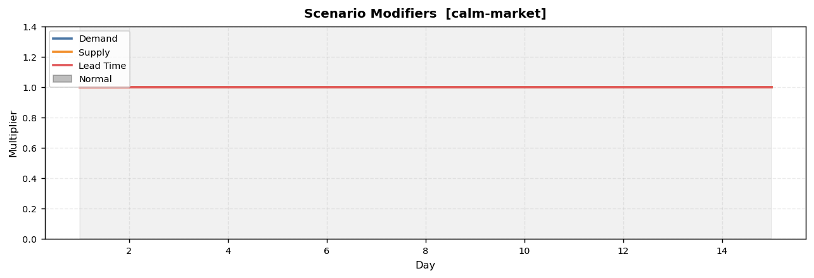 | 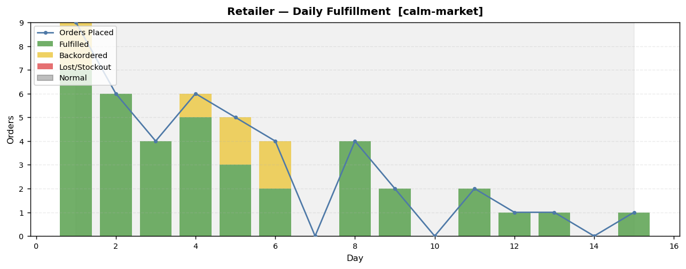 |
| 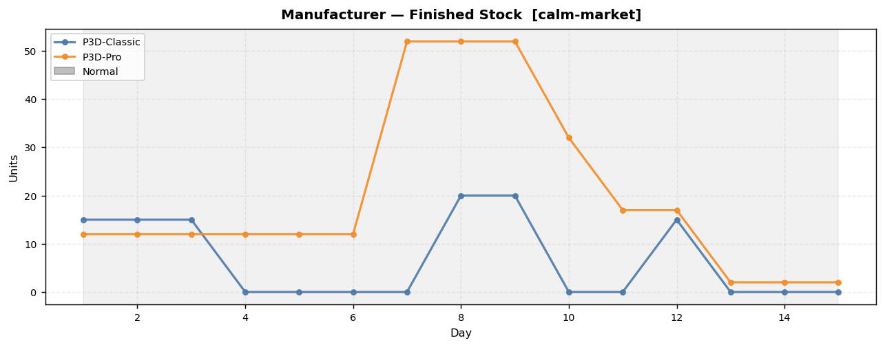 | 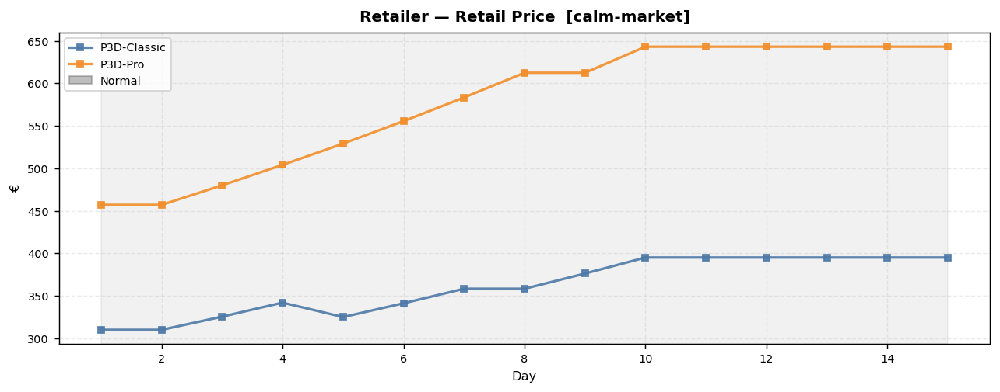 |

### A.2 Holiday Rush

| | |
|---|---|
| 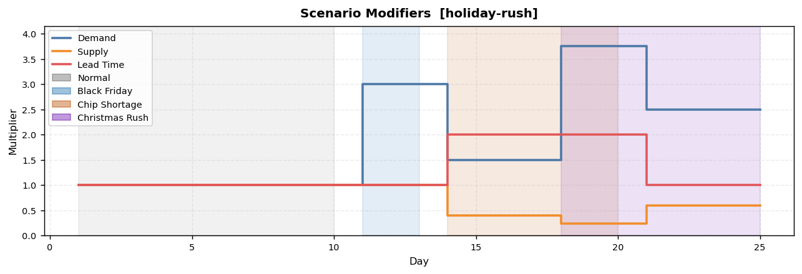 | 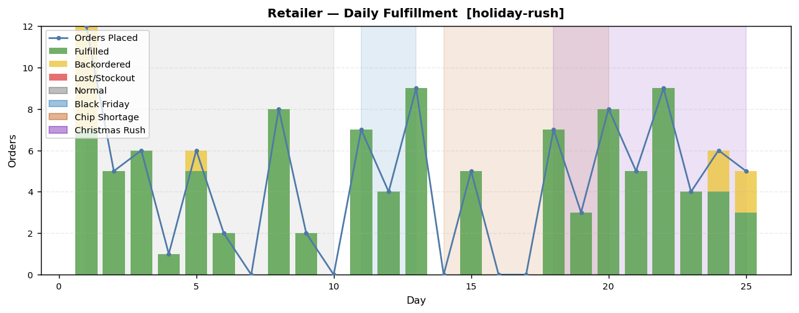 |
| 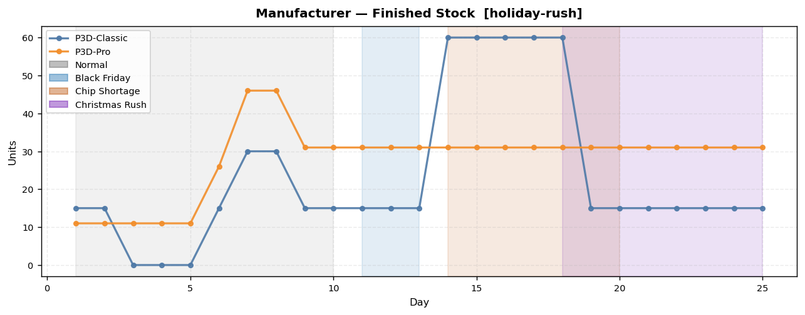 | 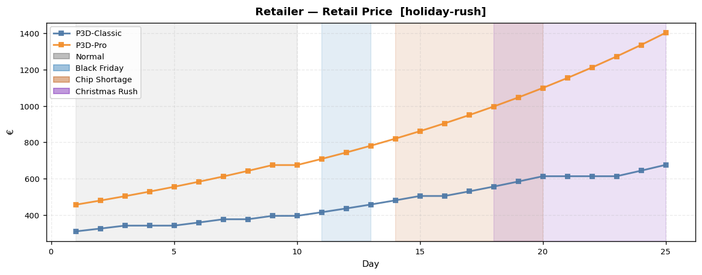 |

---

## Annex B — Dashboard {#annex-b}

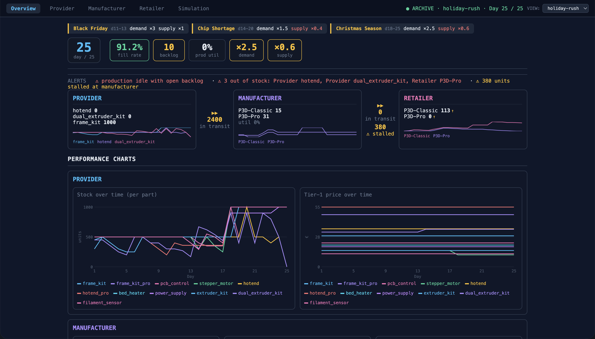

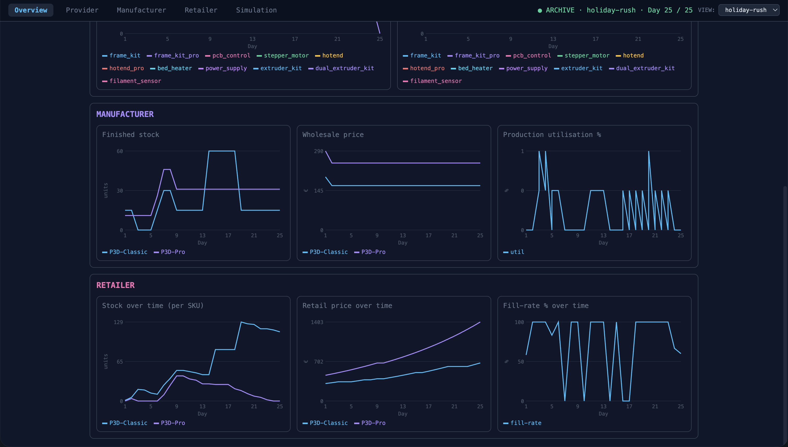

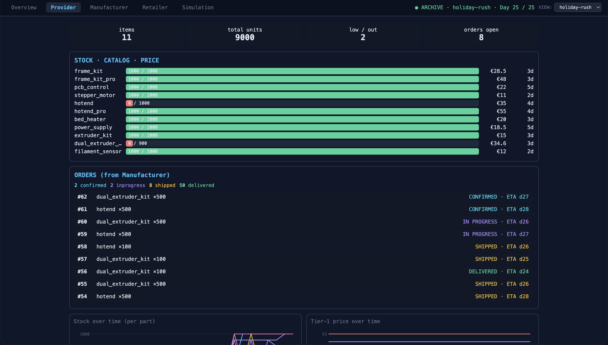

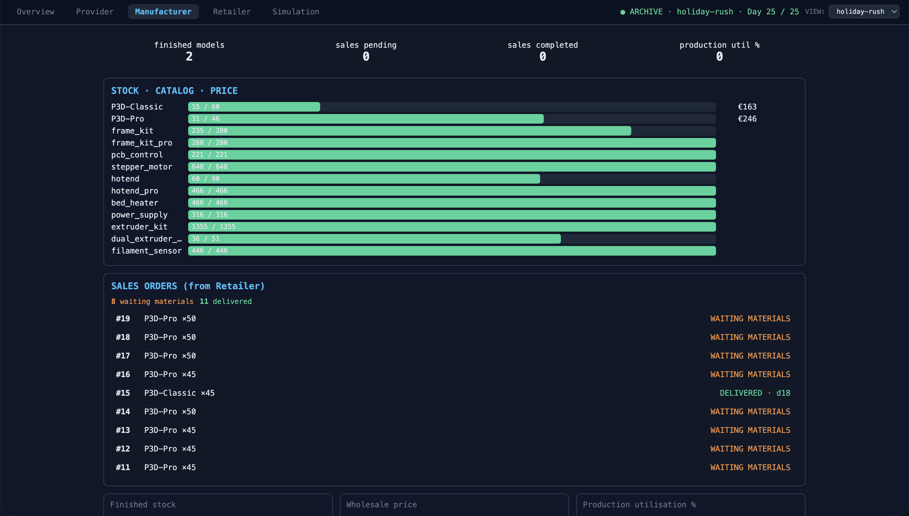

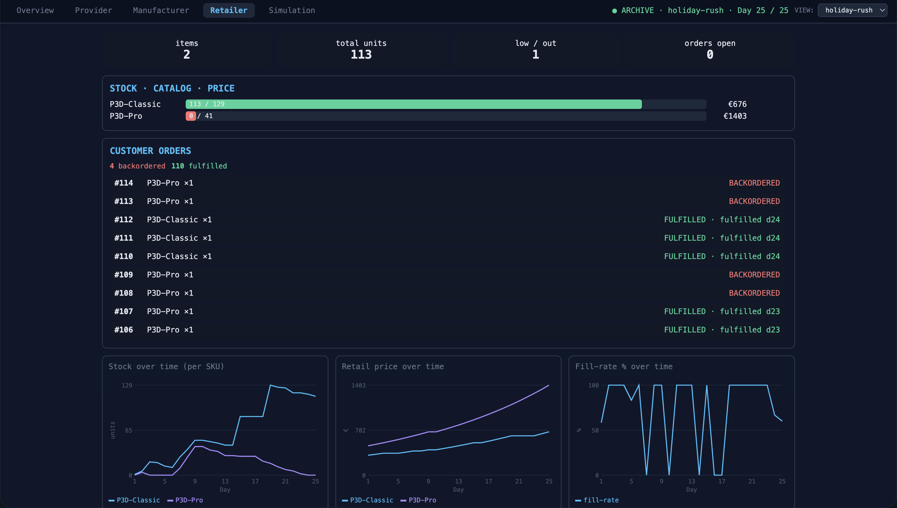

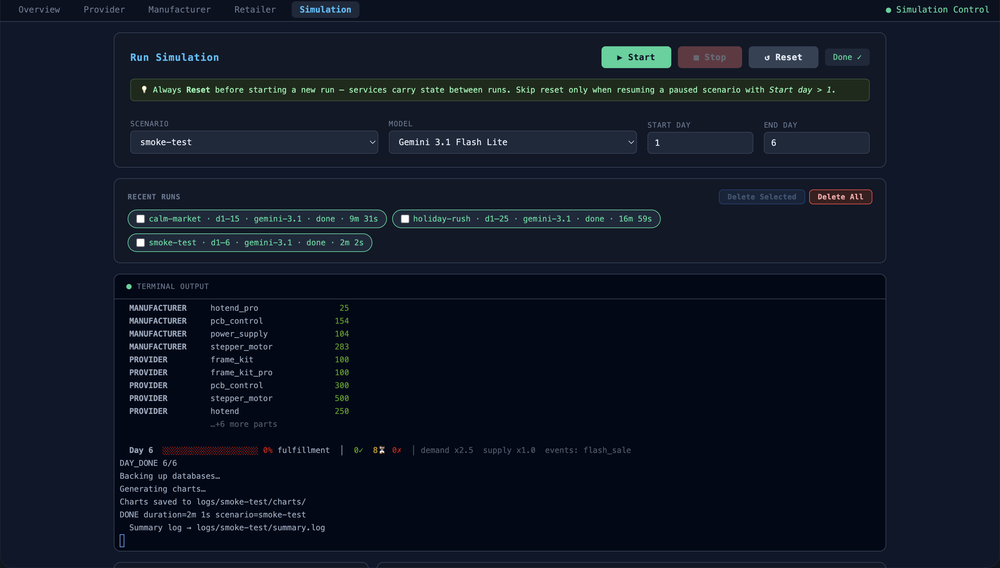

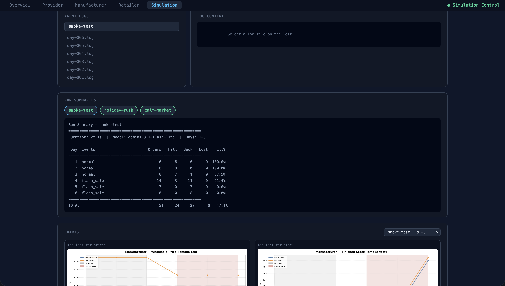
